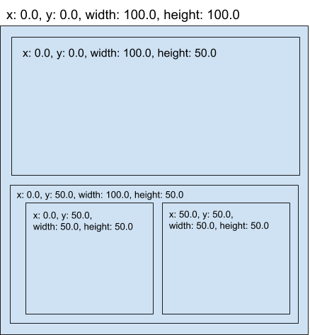

# shoji

<a href="https://docs.rs/shoji"></a>

A VBox/HBox layout library implemented in Rust.  `shoji` allows your layout tree and it's calculations to be separate from your render tree. It's built for speed and style.

```rust
[dependencies]
shoji = "0.1"
```

# Example

In `shoji` your build a graph of layout nodes each with a style that determines:

* direction child condent flows
* margin/padding
* alignment
* etc.

```rust
use shoji::*;

fn main() -> Result<(), &'static str> {
    let mut shoji = Shoji::new();

    // Put together layout
    let top = shoji.new_node(LayoutStyle::default(),vec![]);

    let bottom_left = shoji.new_node(LayoutStyle::default(),vec![]);
    let bottom_right = shoji.new_node(LayoutStyle::default(),vec![]);

    let bottom = shoji.new_node(
        LayoutStyle { direction: Direction:LeftRight },
        vec![bottom_left, bottom_right],
    );

    let root = shoji.new_node(
        LayoutStyle { direction: Direction:TopDown },
        vec![top, bottom],
    );

    // Compute all layouts
    shoji.compute_layout(root, LayoutSize::new(100.0, 100.0))?;

    // Get the calculated layout
    dbg!(shoji.get_layout(top));
}
```

when you `compute_layout` to a constrained size, all layout nodes will have layout calculations with absolute values:

<p align="center">
  
</p>

# License

This project is licensed under either of

 * Apache License, Version 2.0, ([LICENSE-APACHE](LICENSE-APACHE) or
   http://www.apache.org/licenses/LICENSE-2.0)
 * MIT license ([LICENSE-MIT](LICENSE-MIT) or
   http://opensource.org/licenses/MIT)

at your option.

### Contribution

Unless you explicitly state otherwise, any contribution intentionally submitted
for inclusion in `shoji` by you, as defined in the Apache-2.0 license, shall be
dual licensed as above, without any additional terms or conditions.
